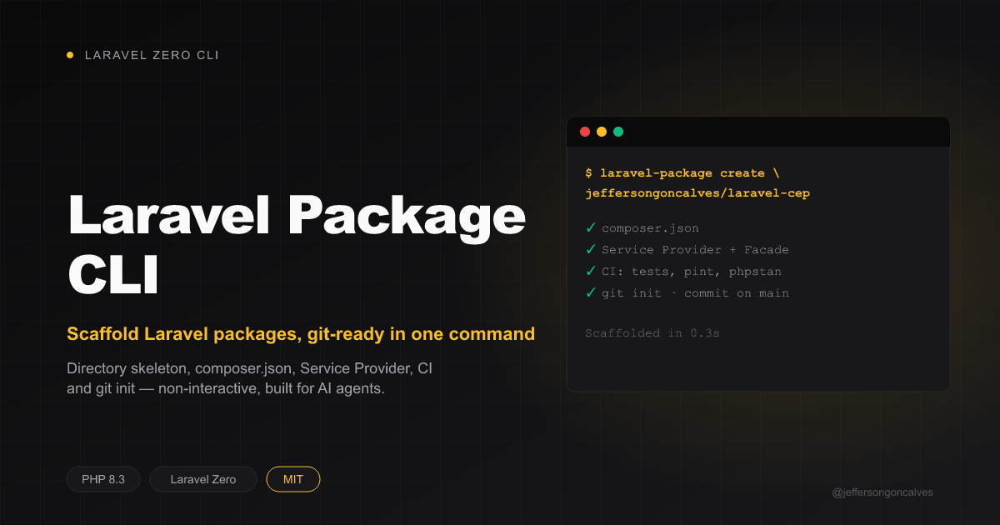

<div class="filament-hidden">



</div>

# Laravel Package CLI

Scaffold new open-source Laravel packages with git already configured, built with [Laravel Zero](https://laravel-zero.com/). Fully non-interactive — every input is an argument or a flag, so it's meant to be driven by an AI agent (e.g. Claude Code's `laravel-package-creator` skill) as much as by a human.

<p align="center">
  <a href="https://github.com/jeffersongoncalves/laravel-package-cli/actions"></a>
  <a href="https://packagist.org/packages/jeffersongoncalves/laravel-package-cli"></a>
  <a href="https://github.com/jeffersongoncalves/laravel-package-cli/blob/main/LICENSE"></a>
  
</p>

## What it does

`laravel-package create vendor/package "Description"` generates the mechanical, repeatable part of a new Spatie-style Laravel package:

- Directory skeleton (`src/`, `config/`, `database/migrations/`, `resources/lang/{en,pt_BR}/`, `tests/`, `art/`, `.github/workflows/`)
- `composer.json` with `spatie/laravel-package-tools`, Pest, Larastan, Pint wired up
- Service Provider (`PackageServiceProvider`) and Facade stubs
- `phpstan.neon.dist`, `phpunit.xml.dist`, `.editorconfig`, `.gitattributes`, `.gitignore`, `LICENSE.md`, `CHANGELOG.md`, `README.md`
- CI workflows: `tests.yml`, `pint.yml`, `phpstan.yml`, `update-changelog.yml`
- `git init`, first commit on `main`

It deliberately does **not** write the package's actual logic (Service Provider bindings, config values, README body, tests, banner) — that's judgment work left to whoever (human or agent) is building the package on top of this scaffold.

## Requirements

- PHP 8.2+
- Git

## Installation

```bash
composer global require jeffersongoncalves/laravel-package-cli
```

Or clone and build locally:

```bash
git clone https://github.com/jeffersongoncalves/laravel-package-cli.git
cd laravel-package-cli
composer install
php laravel-package app:build laravel-package
```

## Usage

```bash
laravel-package create vendor/package [description] [options]
```

### Arguments

| Argument | Required | Description |
|----------|----------|--------------|
| `vendor-package` | yes | `vendor/package` slug, e.g. `jeffersongoncalves/laravel-cep`. Split on `/` to derive vendor, package, namespace (`Vendor\Package`), Service Provider name, Facade name, and `config/<package>.php` filename. |
| `description` | no | Short one-line package description. Used in `composer.json` and the generated `README.md`. Defaults to empty string when omitted. |

### Options

| Option | Description |
|--------|-------------|
| `--path=DIR` | Target directory to scaffold into. Default: `./<package>` under the current working directory. |
| `--namespace=NS` | PSR-4 root namespace, e.g. `"JeffersonGoncalves\PostHog"`. Its last segment also drives the Service Provider, Facade and README title. Default: `StudlyVendor\StudlyPackage` — use this whenever the correct casing can't be derived from the kebab-case slug (`posthog` → `Posthog`, never `PostHog`). |
| `--keywords=LIST` | Comma-separated `composer.json` keywords. Default: `laravel,<package>`. |
| `--require=LIST` | Extra runtime dependencies, comma-separated `name:constraint`. When any `illuminate/*` entry is given, the default `illuminate/contracts` is dropped so it isn't dragged in alongside. |
| `--author="Name"` | Author name for `composer.json` and `LICENSE.md`. Default: `git config user.name`, falling back to `Jefferson Gonçalves` if unset. |
| `--email=EMAIL` | Author email for `composer.json`. Default: `git config user.email`. |
| `--no-git` | Skip `git init` and the first commit — scaffold files only. |
| `--dry-run` | Print the planned file list (write vs. skip-if-exists) without writing anything or touching git. |

Every argument/option is designed for scripted, non-interactive invocation — no prompts are ever shown.

### Examples

Basic package, everything defaulted (author/email from git config, written to `./laravel-cep`):

```bash
laravel-package create jeffersongoncalves/laravel-cep "Brazilian CEP (postal code) lookup for Laravel"
```

No description (left blank in `composer.json`/README):

```bash
laravel-package create jeffersongoncalves/laravel-cep
```

Custom target directory:

```bash
laravel-package create jeffersongoncalves/laravel-cep "Brazilian CEP lookup for Laravel" --path=/d/PROJETOS/jeffersongoncalves/laravel-cep
```

Explicit author/email (overrides git config, e.g. CI or a different identity):

```bash
laravel-package create jeffersongoncalves/laravel-cep "Brazilian CEP lookup for Laravel" \
  --author="Jefferson Gonçalves" \
  --email=jeffersongoncalves@gmail.com
```

Explicit namespace casing, keywords and dependencies (nothing the slug can reveal):

```bash
laravel-package create jeffersongoncalves/laravel-posthog "PHP/Laravel client for the PostHog API" \
  --namespace="JeffersonGoncalves\PostHog" \
  --keywords="laravel,posthog,analytics,feature-flags" \
  --require="illuminate/http:^12.0|^13.0,illuminate/support:^12.0|^13.0"
```

Scaffold files only, no git repo (e.g. dropping into an already-initialized repo):

```bash
laravel-package create jeffersongoncalves/laravel-cep "Brazilian CEP lookup for Laravel" --no-git
```

Preview what would be created without writing anything:

```bash
laravel-package create jeffersongoncalves/laravel-cep "Brazilian CEP lookup for Laravel" --dry-run
```

Full invocation, all options combined:

```bash
laravel-package create jeffersongoncalves/laravel-cep "Brazilian CEP lookup for Laravel" \
  --path=/d/PROJETOS/jeffersongoncalves/laravel-cep \
  --namespace="JeffersonGoncalves\Cep" \
  --keywords="laravel,cep,correios" \
  --require="illuminate/http:^12.0|^13.0" \
  --author="Jefferson Gonçalves" \
  --email=jeffersongoncalves@gmail.com \
  --no-git \
  --dry-run
```

## Testing

```bash
composer test
```

## Changelog

Please see [CHANGELOG](CHANGELOG.md) for more information on what has changed recently.

## Security

If you discover any security related issues, please see [SECURITY](.github/SECURITY.md).

## Credits

- [Jefferson Goncalves](https://github.com/jeffersongoncalves)
- [All Contributors](../../contributors)

## License

The MIT License (MIT). Please see [License File](LICENSE) for more information.
